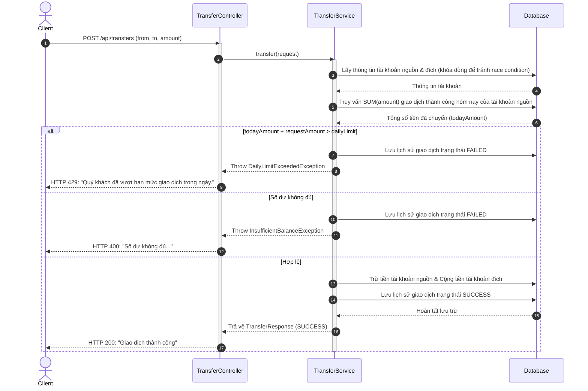

# TÀI LIỆU PHÂN TÍCH SRS - KIỂM SOÁT HẠN MỨC CHUYỂN TIỀN THEO NGÀY

Hệ thống Core Banking yêu cầu bổ sung tính năng kiểm soát hạn mức chuyển tiền hàng ngày (Daily Transfer Limit Control) để giảm thiểu rủi ro giao dịch vượt quá ngưỡng cho phép và bảo vệ tài sản của khách hàng.

---

## 1. Mục tiêu
- Thiết lập cơ chế kiểm soát số tiền tối đa một tài khoản được phép chuyển đi trong một ngày (`dailyLimit`).
- Tự động hóa việc tính toán tổng số tiền đã chuyển trong ngày hiện tại ở mức cơ sở dữ liệu để tối ưu hóa hiệu năng.
- Cung cấp API cập nhật linh hoạt hạn mức chuyển tiền hàng ngày cho từng tài khoản.
- Đảm bảo tính toàn vẹn dữ liệu, chống race condition trong môi trường giao dịch song song.

---

## 2. Functional Requirements (Yêu cầu nghiệp vụ)
- **FR-1**: Mỗi tài khoản ngân hàng (`BankAccount`) phải cấu hình hạn mức giao dịch mặc định hàng ngày (ví dụ: 50.000.000 VNĐ).
- **FR-2**: Khi thực hiện chuyển tiền (`POST /api/transfers`), hệ thống phải kiểm tra:
  - Tổng số tiền chuyển thành công trước đó trong ngày + số tiền giao dịch mới có vượt quá `dailyLimit` của tài khoản nguồn hay không.
  - Nếu vượt quá hạn mức, chặn giao dịch, lưu trạng thái giao dịch là `FAILED`, và ném ra exception `DailyLimitExceededException` (trả về lỗi HTTP 429).
  - Nếu không vượt quá hạn mức, tiến hành kiểm tra số dư và thực hiện giao dịch, lưu trạng thái giao dịch là `SUCCESS`.
- **FR-3**: Cung cấp API cập nhật hạn mức hàng ngày (`PUT /api/accounts/{id}/daily-limit`) cho phép tăng hoặc giảm hạn mức.
- **FR-4**: Lưu lịch sử mọi giao dịch (cả thành công lẫn thất bại) vào bảng `TransactionHistory` để làm cơ sở đối soát.

---

## 3. Non-functional Requirements (Yêu cầu phi chức năng)
- **NFR-1 (Hiệu năng)**: Việc tính tổng số tiền giao dịch trong ngày phải được thực hiện trực tiếp tại Database bằng hàm gộp `SUM(amount)` kết hợp với các chỉ mục thích hợp. Tuyệt đối không được tải toàn bộ danh sách giao dịch lên bộ nhớ JVM để tính toán.
- **NFR-2 (Tính toàn vẹn & Đồng thời)**: Toàn bộ quy trình từ kiểm tra hạn mức, kiểm tra số dư, trừ tiền tài khoản nguồn, cộng tiền tài khoản đích và ghi log lịch sử giao dịch phải chạy trong một Database Transaction duy nhất (`@Transactional`).
- **NFR-3 (Bảo mật)**: Phải validate tham số đầu vào chặt chẽ (số tiền chuyển phải dương, tài khoản nguồn và đích phải khác nhau).

---

## 4. Luồng xử lý nghiệp vụ (Business Flow)



---

## 5. Các Entity cần bổ sung & giải thích các trường

### 5.1. BankAccount (Cập nhật)
Bổ sung trường để kiểm soát hạn mức:
- `dailyLimit` (`BigDecimal`): Hạn mức tối đa được phép chuyển trong ngày. Kiểu dữ liệu sử dụng `BigDecimal` (precision = 19, scale = 4) để tránh sai số thập phân và lưu trữ chính xác các giá trị tiền tệ lớn. Default = 50.000.000 VND.

### 5.2. TransactionHistory (Mới)
Lưu trữ lịch sử giao dịch chuyển tiền.
- `id` (`Long`): Khóa chính tự tăng (`GenerationType.IDENTITY`).
- `fromAccount` (`BankAccount`): Tài khoản chuyển đi (Liên kết Nhiều - Một `@ManyToOne` với `BankAccount`).
- `toAccount` (`BankAccount`): Tài khoản nhận tiền (Liên kết Nhiều - Một `@ManyToOne` với `BankAccount`).
- `amount` (`BigDecimal`): Số tiền giao dịch.
- `transactionTime` (`LocalDateTime`): Thời gian thực thi giao dịch.
- `status` (`TransactionStatus`): Trạng thái giao dịch (`SUCCESS` hoặc `FAILED`).
- `createdAt` (`LocalDateTime`): Thời điểm bản ghi được tạo trong DB.
- `description` (`String`): Mô tả chi tiết giao dịch hoặc lý do lỗi (nếu thất bại).

---

## 6. Quan hệ giữa các Entity
- Một `BankAccount` có thể liên kết với nhiều bản ghi `TransactionHistory` đóng vai trò là tài khoản nguồn (`fromAccount`).
- Một `BankAccount` có thể liên kết với nhiều bản ghi `TransactionHistory` đóng vai trò là tài khoản đích (`toAccount`).
- Mối quan hệ giữa `BankAccount` và `TransactionHistory` là `@ManyToOne` (Từ phía `TransactionHistory` chỉ tới `BankAccount`).

---

## 7. API cần xây dựng

### 7.1. POST /api/transfers (Thực hiện chuyển tiền)
- **Request Body**:
  ```json
  {
      "fromAccountId": 1,
      "toAccountId": 2,
      "amount": 1000000
  }
  ```
- **Response thành công (HTTP 200)**:
  ```json
  {
      "code": 200,
      "message": "Giao dịch thành công.",
      "data": {
          "transactionId": 100,
          "fromAccountId": 1,
          "toAccountId": 2,
          "amount": 1000000,
          "transactionTime": "2026-07-06T13:00:00",
          "status": "SUCCESS",
          "message": "Chuyển tiền thành công."
      }
  }
  ```

### 7.2. PUT /api/accounts/{id}/daily-limit (Cập nhật hạn mức hàng ngày)
- **Path Parameter**: `id` - ID của tài khoản cần cập nhật.
- **Request Body**:
  ```json
  {
      "dailyLimit": 100000000
  }
  ```
- **Response thành công (HTTP 200)**:
  ```json
  {
      "code": 200,
      "message": "Cập nhật hạn mức giao dịch thành công.",
      "data": {
          "id": 1,
          "accountNumber": "111111",
          "balance": 90000000.0000,
          "currency": "VND",
          "accountType": "CHECKING",
          "status": "ACTIVE",
          "dailyLimit": 100000000.0000,
          "createdAt": "2026-07-06T12:00:00"
      }
  }
  ```

---

## 8. Các trường hợp Exception & HTTP Status mapping

| Tên Exception | HTTP Status | Điều kiện kích hoạt | Phản hồi từ hệ thống |
| :--- | :---: | :--- | :--- |
| `DailyLimitExceededException` | `429 Too Many Requests` | Tổng tiền đã chuyển hôm nay + số tiền giao dịch mới vượt hạn mức `dailyLimit`. | `{"code": 429, "message": "Quý khách đã vượt hạn mức giao dịch trong ngày."}` |
| `InsufficientBalanceException` | `400 Bad Request` | Số dư tài khoản nguồn nhỏ hơn số tiền chuyển. | `{"code": 400, "message": "Số dư không đủ để thực hiện giao dịch."}` |
| `AccountNotFoundException` | `404 Not Found` | Không tìm thấy tài khoản nguồn hoặc nhận với ID cung cấp. | `{"code": 404, "message": "Không tìm thấy tài khoản..."}` |
| `ValidationException` | `400 Bad Request` | Số tiền <= 0; ID tài khoản bị trùng; hoặc trạng thái tài khoản không hoạt động. | `{"code": 400, "message": "Số tiền chuyển phải lớn hơn 0."}` |

---

## 9. Thuật toán kiểm tra DailyLimit và Giải pháp kỹ thuật chi tiết

Để xác định xem giao dịch có hợp lệ về mặt hạn mức hay không, hệ thống áp dụng các giải pháp kỹ thuật tối ưu sau:

### 9.1. Giải pháp cộng dồn giao dịch trong ngày tối ưu hiệu năng
- **Tính toán tại Database**: Thay vì kéo toàn bộ lịch sử giao dịch trong ngày của tài khoản lên bộ nhớ RAM của ứng dụng Java (JVM) để tính tổng bằng mã code Java (gây tốn bộ nhớ, chậm trễ do Garbage Collection và tốn băng thông mạng), hệ thống sử dụng hàm gộp `SUM(amount)` ở mức cơ sở dữ liệu.
- **Tối ưu hóa Index**: Để câu lệnh `SUM` chạy nhanh với độ phức tạp thời gian đạt $O(\log N)$ (thay vì quét toàn bảng $O(N)$), bảng `transaction_histories` cần được đánh chỉ mục tổ hợp (Composite Index) trên các trường:
  ```sql
  CREATE INDEX idx_tx_limit_check ON transaction_histories(from_account_id, status, transaction_time);
  ```
  Chỉ mục này cho phép hệ thống tìm kiếm ngay lập tức các giao dịch thuộc tài khoản gửi đi, lọc theo trạng thái và lọc theo khoảng thời gian trong ngày mà không cần duyệt qua các dòng dữ liệu không liên quan.
- **Cách ly trạng thái giao dịch**: Hệ thống chỉ cộng dồn các giao dịch có trạng thái `SUCCESS`. Các giao dịch `FAILED` (ví dụ do lỗi số dư, lỗi hệ thống) không làm ảnh hưởng đến hạn mức thực tế của khách hàng.

### 9.2. Giải pháp xử lý ranh giới ngày và múi giờ (Timezone & Date-Time Boundary)
- Để tránh sai lệch ranh giới ngày khi máy chủ ứng dụng và máy chủ cơ sở dữ liệu lệch múi giờ, hệ thống định nghĩa ranh giới ngày hiện tại một cách rõ ràng ở phía ứng dụng Java sử dụng múi giờ nội địa chuẩn:
  - **Giờ bắt đầu**: `startOfDay = LocalDate.now().atStartOfDay();` (`00:00:00.000`)
  - **Giờ kết thúc**: `endOfDay = LocalDate.now().atTime(LocalTime.MAX);` (`23:59:59.999999999`)
- Khoảng thời gian này được truyền dưới dạng tham số ràng buộc kiểu `LocalDateTime` vào JPQL giúp đảm bảo tính nhất quán và chính xác ở tầng CSDL.

### 9.3. Giải pháp chống Race Condition trong giao dịch đồng thời (Concurrency Control)
- **Vấn đề Race Condition**: Nếu khách hàng gửi cùng lúc 2 yêu cầu chuyển tiền từ cùng một tài khoản (Double-Spending / Concurrent Request), cả 2 luồng xử lý song song có thể chạy câu lệnh `SUM` cùng một lúc và đều đọc ra cùng một giá trị tổng giao dịch hôm nay. Cả hai đều kiểm tra thấy dưới hạn mức và cùng thực hiện trừ tiền thành công, dẫn đến tổng số tiền chuyển thực tế vượt quá `dailyLimit`.
- **Giải pháp Khóa Bi quan (Pessimistic Locking)**: 
  - Trong luồng xử lý `@Transactional`, khi đọc thực thể `fromAccount` từ CSDL, hệ thống áp dụng cơ chế khóa ghi bi quan `PESSIMISTIC_WRITE` (tương đương câu lệnh SQL `SELECT ... FOR UPDATE`).
  - Khi một giao dịch đang đọc và cập nhật tài khoản nguồn, CSDL sẽ giữ khóa dòng trên tài khoản đó. Bất kỳ giao dịch đồng thời nào khác cố gắng truy vấn tài khoản này để thực hiện chuyển tiền đều phải đợi (blocked) cho đến khi giao dịch đầu tiên kết thúc (commit hoặc rollback).
  - Điều này đảm bảo các giao dịch chuyển tiền từ cùng một tài khoản được tuần tự hóa (serialized), loại bỏ hoàn toàn khả năng bypass hạn mức ngày hoặc số dư do race condition.

### 9.4. Thuật toán kiểm tra hạn mức tuần tự
1. Lấy ranh giới thời gian `[startOfDay, endOfDay]` của ngày hôm nay.
2. Thực hiện khóa dòng tài khoản gửi (`fromAccount`) bằng `PESSIMISTIC_WRITE`.
3. Chạy câu lệnh JPQL tính tổng tiền đã chuyển thành công:
   ```java
   BigDecimal todayAmount = transactionHistoryRepository.sumAmountByAccountAndTransactionTimeBetweenAndStatus(
           fromAccount, startOfDay, endOfDay, TransactionStatus.SUCCESS);
   ```
4. Kiểm tra điều kiện hạn mức:
   - Nếu $\text{todayAmount} + \text{requestAmount} > \text{fromAccount.dailyLimit}$:
     - Ghi nhận lịch sử giao dịch là `FAILED` với mô tả lý do vượt hạn mức.
     - Ném lỗi `DailyLimitExceededException` (Hệ thống trả về HTTP 429).
   - Nếu $\text{todayAmount} + \text{requestAmount} \le \text{fromAccount.dailyLimit}$:
     - Đi tiếp đến kiểm tra số dư khả dụng và thực hiện trừ/cộng tiền.

